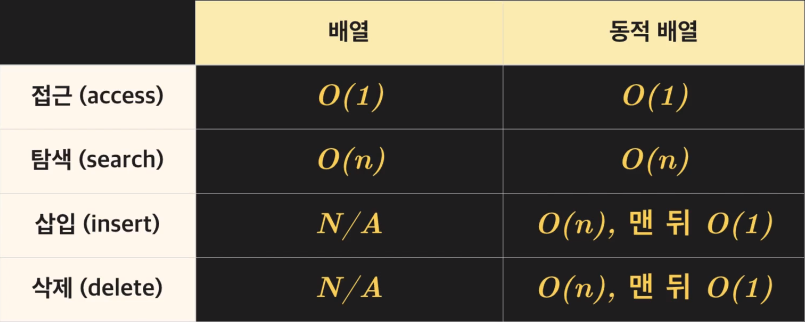
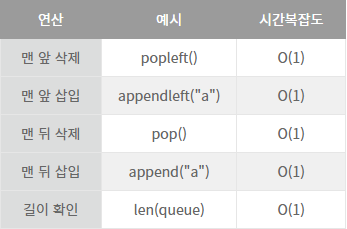
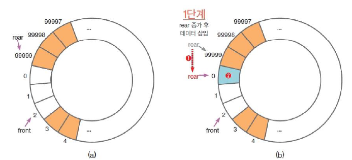
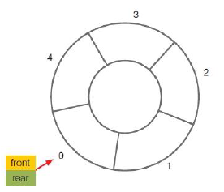
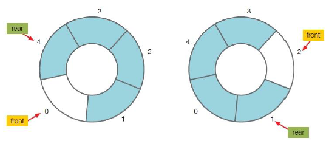
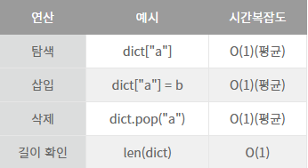
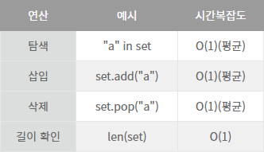

## __자료구조__
* [저장공간](#저장공간)
* [배열](#배열)
* [추상자료형](#추상자료형)
  * 큐
    * [선형 큐](#선형-큐)
    * [원형 큐](#원형-큐)
  * [스택](#스택stack)
  * [딕셔너리](#딕셔너리dictionary)
  * [세트](#세트set)
* [추상자료형의 실행시간 비교](#추상-자료형-실행시간-비교)


> #### 저장공간
* 스토리지 : 데이터가 영구적으로 저장되는 곳, 저장되어 지는 용량이 큼
    * 장점 : 저장하는 용량이 크다, 지워지지 않는다.
    * 단점 : 저장하는데 오래걸리고, 로딩이 오래걸린다.
* 메모리 : 데이터를 임시로 저장 하는 곳
    * 장점 : 저장이 빠르고, 로딩이 빠르다.
    * 단점 : 컴퓨터가 종료 되거나 창이 꺼지면 저장되어 있는 데이터가 없어짐

> 왜저장 공간이 두 개로 나뉘어져 있는가?

영화를 예로 들 수 있다.

영화가 저장이 되어있는 장소는 스토리지 이다. 하지만 스토리지에서 영화를 재생하게 되면 로딩도 느리고 영화가 재생이 되는데 끊길 가능성이 있다.

그래서 영화를 메모리로 복사를 한 후 메모리에서 영화를 재생하게 된다면 로딩이 빨리 이루어 지기 때문에 끊김없이 재생이 된다.

```
# RAM(Random Access Memory)
임의 접근 메모리라는 뜻을 가진 Ram은 말 그래도 메모리 저장소 이다.

저장 위치만 알면 접근시 항상 일정 시간이 걸린다.
어떤 메모리 던지 위치만 알면 바로 접근이 가능하다.
```
---

### 배열
배열은 Python의 list라고 생각 하면 된다. 

인덱스를 이용한 데이터 저장/접근법 이다.
> 배열의 장점

배열의 시간 복잡도를 따져볼때 단순히 접근 할 때에는 단순히 O(1)이 차지한다.

주소만 알고 있으면 한번에 접근 할 수 있다.

> 배열 탐색
* 접근 : 인덱스를 통해 원한느 값을 찾는 것을 의미합니다.
    * 접근연산  : O(1)
* 탐색 : 특정 조건을 만족할 만한 것을 찾는 것을 의미한다.
    * 탐색연산 : O(n)

> 배열의 종류
* 정적 배열 : 크기가 종류가 고정되어 있는 배열 
    * 크기가 고정되어 있기 때문에 낭비하는 공간이 없다.
* 동적 배열 : 크기가 요소의 갯수만큼 자동으로 늘어나는 배열
    * 공간을 낭비할 수도 안할 수도 있다.



---
## __추상자료형__
파이썬 리스트의 경우 내부적으로 동적배열로 구현되어 있는데,

삽입(insert), 검색(search), 삭제(delete) 각각의 기능만 이해하고 있다면,

내부적으로 어떻게 구현되어 있는지 몰라도 쉽게 사용할 수 있도록 되어있는 것이 추상 자료형이다.

 

예를 들어, 핸드폰으로 상대방에게 연락을 하고 싶을 때, 

실제로 문자가 휴대폰 내부의 어떠한 로직에 의해 전송되는지 몰라도

문자를 보내면 상대방과 연락할 수 있다는 것은 알 수 있다. 

배열이나 리스트의 구조와 기능을 적절히 사용하면 추상자료형을 효율적으로 구현할 수 있다.

---


> 추상자료형 vs 자료 구조

추상 자료형과 자료 구조는 뭐가 더 중요한 거라기 보단 그냥 서로 다른 개념이다.

기능을 중점적으로 얘기하고 싶을 때나, 흐름을 생각할 때와 같이 구현에 집중할 필요가 없을 때 **추상 자료형**을, 

 그리고 코드의 성능을 분석하거나 최적화 시켜야 될 때나 (성능을 최대로 끌어올리고 싶을 때) **자료 구조**를 중심적으로 생각하면 될 것 같다.

 > ### 선형 큐

FIFO(First in First Out)

먼저 들어가는 데이터가 먼저 나오는 입구 출구가 따로 있는 원통 형태

맨 뒤 삽입 + 맨 앞 접근 및 삭제 기능이 필요하다.

따라서 더블리 링크드 리스트를 이용해 O(1)으로 처리하는 것이 빠르다.

파이썬의 deque는 더블리 링크드로 구현되어 있다.


```python
from collections import deque

queue = deque()

# 큐의 맨 끝에 데이터 삽입
queue.append("A")
queue.append("B")

# 맨 앞 데이터 접근
print(queue[0])

# 맨 앞 데이터 삭제
print(queue.popleft())

print(queue) # 큐 출력

>>>  A
>>>  A
>>>  deque(['B'])
```


* [큐 추상자료형 구현 바로가기](https://github.com/JIKMAN/Algorithm/blob/master/Data_Structure/Queue.py)

> ### 원형 큐

* 일반큐는 큐가 꽉 찼을 경우, 데이터 삽입 시 데이터를 한칸 씩 끌어와야 하므로 오버헤드가 발생하는 문제점이 있음.
* 원형 큐는 데이터 삽입 시오버헤드가 발생하지 않음



#### 원형 큐 원리

* 원형 큐가 빈 경우 : `front == rare`

  

* 원형 큐가 꽉 찬 경우 : `if (rear +1) % (큐의 SIZE)  == front`

  

* 원형 큐는 빈 것과 꽉 찬 것을 구별하기 위해 기본적으로 한칸을 비워두게됌
  * 예시) 일반 큐와 다르게 초기 front, rear 값을 index 0으로 설정하여 index 1부터 데이터가 쌓이게 함
  
* 데이터 삽입 시 : `rear = (rear + 1) % (큐의 SIZE)`

  * 선형 큐의 경우 데이터 삽입 시 출구쪽이 비어있다면 데이터를 한칸씩 땡겨와야 하기 때문에 삽입에 O(n)의 시간복잡도가 걸리는 반면,

    원형 큐의 경우 데이터의 위치와 관계없이 O(1)

* 데이터 추출 시 : `front = (front + 1) % (큐의 SIZE)`

#### [원형 큐 구현 바로가기]((https://github.com/JIKMAN/Algorithm/blob/master/Data_Structure/rounded_queue.py))

---


 > ### 스택(Stack)

 LIFO(Last in First Out)

 나중에 들어간 데이터가 가장 먼저 나오는 입구와 출구가 같은 형태

맨 뒤 삽입 + 맨 뒤 접근 및 삭제 기능이 필요하다.

따라서 큐와 마찬가지로 더블리 링크드 리스트를 이용하는 것이 효율적이다.
```python
from collections import deque

stack = []

# 스택 맨 끝에 데이터 추가
stack.append("A")
stack.append("B")

# 맨 끝 데이터 접근
print(stack[-1])

# 맨 끝 데이터 삭제
print(stack.pop())

print(stack) # 스택 출력

>>>  B
>>>  B
>>>  ['A']
```

Stack은 동적 배열과 더블리 링크드 리스트 둘 다로 구현할 수 있다.

* [스택 추상자료형 구현 바로가기](https://github.com/JIKMAN/Algorithm/blob/master/Data_Structure/Stack.py)

|            | 동적배열       | 링크드 리스트 |
| ---------- | -------------- | ------------- |
| 맨 뒤 삭제 | 분할 상환 O(1) | O(1)          |
| 맨 뒤 삽입 | 분할 상환 O(1) | O(1)          |
| 맨 앞 접근 | O(1)           | O(1)          |


---

> ### 딕셔너리(Dictionary)
해시 테이블을 이용하여 구현

```python
fruits = {}

fruits["사과"] = 500
fruits["배"] = 1000

# 한 key에 여러 value를 저장하게되면 마지막에 저장한 value로 바뀜
fruits["배"] = 700

# key를 통해 value 탐색
print(fruits["사과"])

# 딕셔너리 출력
print(fruits)

>>>  500
>>>  {'사과': 500, '배': 700}
```



---

> ### 세트(Set)
데이터간의 순서가 없는 추상자료형, 해시 테이블을 이용하여 구현

```python
contries = set()

# 데이터 저장
contries.add("한국")
contries.add("미국")
contries.add("중국")

# 데이터가 중복해서 저장되지 않는다.
contries.add("한국")

# 데이터 탐색
print("미국" in contries)

print(contries)

>>>  True
>>>  {'미국', '중국', '한국'}
```


---

### 추상 자료형 실행시간 비교

리스트의 탐색 연산의 경우 O(n)의 시간복잡도가 걸리고,

세트의 경우 평균 O(1)의 시간복잡도가 걸린다는 것을 알아봤다.

| 시간복잡도 | 리스트(동적 배열) | 세트(해시 테이블) |
| ---------- | ----------------- | ----------------- |
| 탐색 연산  | O(n)              | O(1)              |

실제로 실행 시간을 비교해보자.

```python
import time

# 데이터를 리스트에 저장한다.
test_list = [_ for _ in range(0, 1000000)]

# 999999라는 특정 값이 리스트에 있는지 확인할 때 걸리는 시간
t0 = time.time()
999999 in test_list
t1 = time.time()

print(f"리스트에서 탐색에 걸린 시간: {t1 - t0}")

>>> 리스트에서 탐색에 걸린 시간: 0.013655900955200195
```

* 리스트에서 탐색에 걸린 시간은 약 0.013초

```python
import time

# 데이터를 세트에 저장한다.
test_set = set([_ for _ in range(0, 1000000)])

# 999999라는 특정 값이 세트에 있는지 확인할 때 걸리는 시간
t0 = time.time()
999999 in test_set
t1 = time.time()

print(f"세트에서 탐색에 걸린 시간: {t1 - t0}")

>>> 세트에서 탐색에 걸린 시간: 3.814697265625e-06
```

* 세트에서의 탐색은 0.00000381초

 

리스트로 구현된 프로그램에서 13초나 걸리던 기능이,

세트로 구현된 프로그램에서는 단 0.00381초만에 실행되는 어마어마한 차이다.

 

즉, 적절한 자료형을 선택한다면 프로그램을 좀 더 효율적으로 구현할 수 있다.
